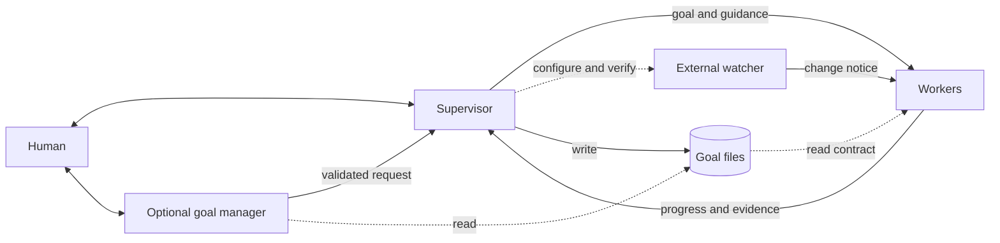
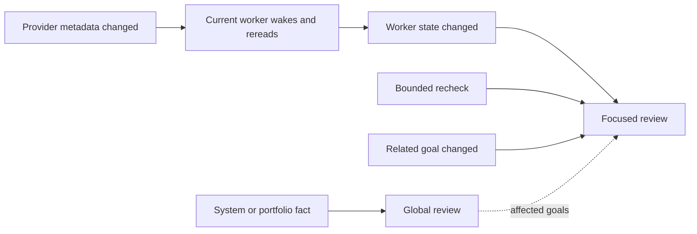
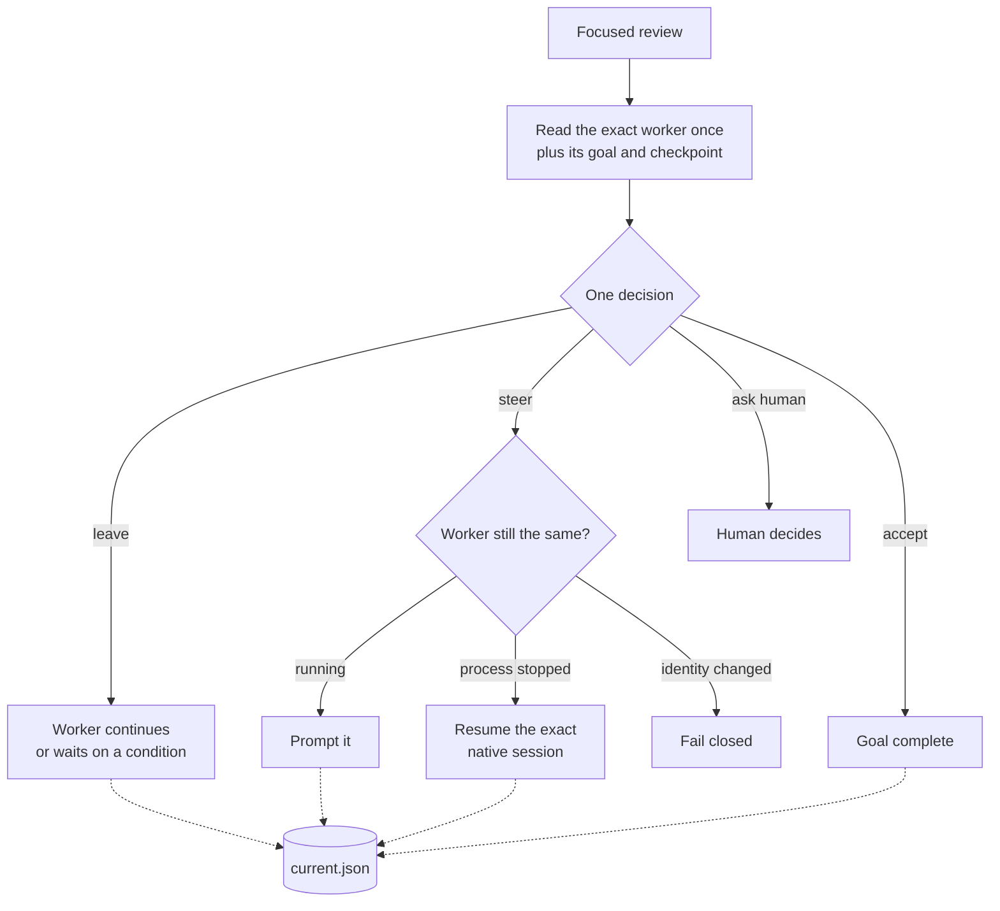
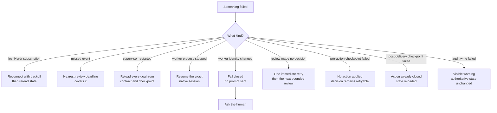

# Herdr Supervisor design

**Status:** Current design

## Purpose

Herdr Supervisor helps one person keep several goal-owning workers moving. It
stays lightweight: the supervisor judges progress, workers do the work, and an
optional external watcher wakes workers when a pull request or build changes.
It does not build another task system.

Herdr hosts the processes and events, and Codex supplies each worker's native
Goal loop. Those are implementation choices, not extra product roles.

The core rule is:

> Code collects current facts and executes a validated choice. The model makes
> the semantic choice.

The extension rule is equally small:

> **Events carry facts. Knowledge guides action.**

An observation path says what changed and wakes one statically chosen
responsible agent. Plain-language, version-controlled guidance tells that
agent why the event matters, what evidence to inspect, which existing actions
are available, and what useful result to produce. The agent still judges the
current case. Neither the event nor the guidance is an executable workflow.

The whole model is:

1. The human defines or refines a goal.
2. One worker owns that goal and keeps pursuing it.
3. The supervisor watches evidence and helps the same worker move forward.
4. An optional external watcher notifies the worker when a linked resource
   changes.
5. A failure enters the same observation and decision loop with diagnostic
   facts and operating guidance.

There are no hidden tasks, per-resource watch objects, diagnostic workflows, or
parallel sources of goal truth.

## Scope discipline

The Supervisor implements the small foundation that every goal needs and lets
the model handle situational judgment. The practical heuristic is **solidify
the common 20%; teach the model the remaining 80%**. This is not a feature
quota. It is a test for whether a behavior belongs in code.

The minimal core lets an agent:

- **observe** current worker and external facts;
- **decide** what those facts mean for the goal;
- **act** through small validated effects;
- **remember** the portable goal and latest local checkpoint; and
- **wake** on meaningful events or a bounded health check.

New integrations extend facts with a deterministic observer, action with
durable response knowledge, or both. Keep those surfaces separate: guidance
can improve with experience without changing delivery or persistence. Do not
translate it into code branches merely because it is explicit.

For every new request or failure, ask in order:

1. Can the agent handle it with those existing primitives?
2. Will the agent reliably be triggered to handle it?
3. Does the agent receive enough durable knowledge and current context to
   choose well?

If all three answers are yes, add no runtime feature. Improve the goal context,
prompt, or operational documentation when useful, then let the agent do the
work. If an answer is no, fix the smallest missing foundation: capability,
trigger, or knowledge. Promote a behavior into code only when it recurs, is
unsafe or materially unreliable as judgment, wastes meaningful resources, or
has another clear general benefit.

Put behavior in code only when it is:

- common to many goals rather than one observed incident;
- deterministic identity, persistence, scheduling, or effect execution;
- unsafe or unreliable to reproduce through ordinary model judgment; and
- small enough to state as an invariant and prove with focused tests.

Keep behavior in prompts, operational guidance, or the goal's own context when
the model can inspect current facts and choose a safe action. One missing pane,
one provider quirk, or imperfect reconstruction after restart does not justify
a new recovery subsystem. Prefer a visible failure and a fresh model decision;
some repeated work or model cost is acceptable when the final result remains
correct.

The foundation is therefore limited to portable goal contracts, exact worker
identity, atomic current checkpoints, event wakeups with bounded health checks,
validated effects, and clear current evidence. Provider integrations are
optional observation adapters, not new workflow engines. A larger mechanism
needs repeated live evidence that these primitives and ordinary agent reasoning
cannot handle the problem cleanly.

## Mental model

There are four core roles:

- The human states and refines outcomes and makes decisions that require human
  authority.
- A worker pursues one durable goal in one exact native agent session.
- The supervisor observes evidence, judges progress, and helps the same worker
  continue. It also assembles and verifies any shared observation path needed
  by the supervised portfolio.
- An optional external watcher detects relevant provider changes and wakes the
  affected worker with bounded observed facts. It does not judge the change,
  and the worker rereads provider authority before acting.

Every observation path has one fixed responsible role chosen when that path is
wired. Current pull-request and build changes wake their linked worker. A
future portfolio observation, if live evidence justifies it, may wake the
supervisor's existing global review instead. Events do not contain a generic
target, and the watcher does not choose a recipient at runtime.

For a busy portfolio, the human may also open an ordinary Codex **goal
management pane**. It is an interactive client, not another service, task,
supervisor, or source of truth. It helps the human explore outcomes, inspect the
portfolio, and form goal changes. It reads the same goal store and Herdr state,
then relays an authorized complete action to the uniquely named `supervisor`,
which remains the single validated mutation path. The Pi supervisor can stay
focused on background event reviews while the management pane handles longer
human discussion.

Herdr owns panes, processes, native sessions, status, and events. The worker
owns implementation and detailed evidence. The supervisor owns the goal
contract, its latest review checkpoint, and the judgment about what to do next.
One native agent session can belong to only one unfinished goal, regardless of
which pane currently routes to it.

The supervisor derives each worker's short display label from its goal and asks
Herdr to display it. The opaque goal ID, terminal ID, and native session ID
remain authoritative. A label helps a human navigate; it is not stored state,
never selects a worker, and never proves identity.

One goal-store root has one supervisor writer. Management panes are read-only
clients that relay mutations to that writer; running multiple supervisors
against the same root is outside the architecture. This keeps goal lifecycle
serialization local and avoids pretending to provide a distributed
transaction across goal files and Herdr worker creation.

A supervised goal is not a second task. It is one portable outcome contract
bound to one exact worker. One worker may use several repositories or
worktrees without creating more supervisor goals.

## Architecture

Three diagrams, each answering one question.

### Who owns what



The runtime owns processes, native sessions, and event delivery. The supervisor
owns goal contracts, concise checkpoints, and judgment. Workers own
implementation and detailed evidence. Each goal keeps three files:
`goal.json` (the outcome), `current.json` (where execution stands), and
`journal.jsonl` (audit only).

### What wakes work



The supervisor sleeps otherwise. It does not poll workers or providers. The
optional shared watcher performs bounded provider reads without model turns.
The low-frequency global review remains a safety net for missed system-level
events, not the primary way to discover facts that a cheap observer can report.

### One review, one decision



Every decision commits the checkpoint, then appends a best-effort audit entry.
An audit failure is visible but never rolls back the authoritative checkpoint.
A steer never substitutes a different worker — if identity cannot be
confirmed, it fails closed and asks the human.

In plain language:

- You may talk directly to the supervisor, or use one ordinary Codex management
  pane for portfolio discussion while the supervisor handles background events.
- It turns each durable outcome into a goal and starts one Codex worker for it.
  Multiple workers run in parallel.
- Workers use their native Codex Goal loop and do not need constant prompting.
- The supervisor normally sleeps until something meaningful happens.
- It reads one bounded piece of evidence and makes exactly one decision.
- If a worker pane disappears, it restores the exact saved session. It never
  silently substitutes another worker.

## Normal flow

1. The human describes an outcome.
2. The model forms a concrete candidate goal: objective, continuity horizon,
   expected artifacts, acceptance evidence, stable context, and constraints.
   It leads with a useful interpretation and recommended defaults.
3. If one answer would materially change that candidate's outcome, proof,
   authority, or risk, the model shows the candidate and asks one focused
   question. Recommended defaults may fill ordinary detail, but cannot invent
   a new kind of work, deliverable, external effect, or authority. Otherwise
   the model proceeds without ceremony. Research and synthesis, building and
   experimentation, and external operation are distinct work modes rather than
   interchangeable defaults. A finite deliverable and a standing loop are also
   distinct horizons; if the stopping condition is materially unclear, the
   model recommends one and asks before starting.
4. Only then does the model compare the candidate with existing goals. It
   reuses an equivalent outcome, updates a true refinement, or defines one new
   distinct goal.
5. Code validates that contract, creates or selects one meaningfully labelled
   worker space, starts Codex, records its exact native session, and gives it
   the native `/goal`.
6. The worker keeps working without supervisor model turns.
7. A Herdr event or bounded deadline asks the supervisor to review that goal.
8. Code supplies the goal, fresh Herdr state, and bounded new worker evidence.
9. The model chooses one review decision. Code validates and applies it.
10. Supervision ends only when evidence proves the complete outcome or the human
   explicitly stops it.

Goal equivalence is intentionally stricter than relatedness. The objective,
continuity horizon, expected artifacts, and acceptance evidence must be
substantially the same. Sharing a topic, source, tool, repository, or worker
capability does not make two outcomes equivalent, and a constraint inside one
goal never becomes an admission rule for other goals.

A new distinct goal owns its own duties. Its creation does not authorize
rewriting a related goal to permit coexistence or adding coordination work to
that goal. If the new outcome truly depends on changing what another worker
must do, that expansion requires the human's decision.

The model owns that semantic comparison. Code provides only idempotency: an
exact replay of every portable contract field reuses the existing goal. It
never merges new work by objective text alone. Once the model identifies a
semantically equivalent goal, it continues that exact goal ID instead of
restating a new contract.

When the human contradicts, retracts, or disowns a statement already stored in
a goal contract, the supervisor updates that same contract before asking its
worker to continue.
A transient reconsideration can carry new execution evidence, but it cannot
override a contradictory `goal.json` or substitute for removing a constraint
the human did not authorize.

The supervisor is normally asleep. Events improve response time; a single
nearest-deadline timer ensures missed events or long waits do not lose a goal.
Its default one-hour interval is a safety net, not a polling cadence; deployments
can tune it when their event reliability or recovery needs differ.

## Decisions

An automatic focused review has exactly four semantic decisions:

- `leave`: current work is healthy, or a settled worker has one concrete wait
  condition. Recheck on its next event or bounded deadline.
- `steer`: the same worker can take one useful next action now.
- `ask_human`: one missing decision or fact genuinely requires the human.
- `accept`: current evidence proves the entire objective and every acceptance
  criterion at the declared scope and time horizon.

`stop` is a separate operator action. It ends supervision when the human asks;
it is not a model review decision.

Resuming a native Goal is also not a model decision. If `steer` is chosen for
an exact settled Codex worker, code resumes its native Goal before sending the
instruction into the active turn. If the process exited while its pane and
native session remain recoverable, code resumes that same session first. An
empty pane restored with a new terminal refreshes that transient checkpoint. A
missing pane may be replaced as a routing location only when the recorded
session supports exact resume and code verifies that saved identity. A changed
or unsupported session fails closed.

The model never chooses transport, invents worker identity, or directly edits
checkpoint files. Code never infers semantic intent from keywords or a growing
set of workflow-specific branches.

## Goal data

The goal-store root explains itself, and each goal keeps up to three files in
one stable directory:

```text
goals/
├── README.md
├── g_<id>/
│   ├── goal.json
│   ├── current.json
│   └── journal.jsonl
└── .supervisor/
```

The supervisor places the concise root guide when it first writes to a goal
store; reads never create or change files. The guide documents file authority,
lifecycle, safe inspection, and portability for any agent or human with direct
filesystem access. It is one shared explanation, not repeated metadata or a
skill inside every goal. Existing root files are never overwritten.

`goal.json` is the portable contract. It contains only:

- objective;
- stable context needed to pursue it;
- acceptance criteria;
- lasting constraints.

A human refinement belongs in this contract when it must still govern a fresh
worker that has no conversation history or local checkpoint. This fresh-start
test separates lasting outcome scope, recurring behavior, proof, and boundaries
from transient execution evidence. Reconsidering or steering the current worker
cannot substitute for updating durable authority.

`goal.json` is the only goal data needed to start fresh on another instance.
Place it in a valid goal directory there before starting a worker. It contains
no pane, session, progress, wait, cursor, or history.

Within one instance, an unstarted saved contract is resumed by passing its exact
goal ID to the same start operation used for a new goal. Code loads that contract
and creates its worker; the model does not restate the contract or create a
sibling merely because the goal has no worker yet.

If the human explicitly selects an exact saved goal that has never started, the
supervisor may discard it. Code requires a directory containing only
`goal.json`; active goals, completed goals, audit history, and unknown files
fail closed. Age, apparent duplication, or a global-review finding never grants
discard authority. The store guide explains the hidden `.discarding-*` claim
and its manual fail-closed recovery if the supervisor exits during that short
operation; ordinary reads do not grow a recovery workflow for this rare case.

The supervisor's ordinary status view lists the exact IDs and objectives of
active and unstarted goals. Reading one exact goal returns its complete contract
and, when it is terminal, its stored result and evidence. This is supervised
goal data the model already owns, not general filesystem access. The summary
stays compact while the exact read gives the model enough information to compare,
resume, or discuss goals without asking the human to paste them again. If Herdr
is temporarily unavailable, exact goal reads still return stored saved, active,
or completed state while clearly marking unavailable live worker state. An
exact pane query still requires Herdr because it is a runtime observation.

`current.json` is the latest local checkpoint. It contains the exact worker
binding, concise progress, retained evidence, observation cursor, last decision,
optional wait, and optional terminal result. It does not copy live worker or
provider status; those facts stay with Herdr and the provider.

Tool arguments keep the same boundary explicit. An optional value that does not
apply is `null`; the model never invents a placeholder identity, revision,
watch, wait, or deadline merely to fill a field. Code validates real values and
executes the decision, while `null` carries no semantic claim.

`journal.jsonl` is append-only audit history. It is useful for inspection but
is never replayed to rebuild the current goal. A missing journal cannot stop
recovery; an invalid goal or checkpoint fails closed.

`.supervisor/` holds local supervisor checkpoints. It is neither portable goal
authority nor live runtime truth.

In-memory runtime data holds only disposable scheduling details such as the
next review time, coalesced signal, and one-turn observation fence. Durable
bindings and transient runtime state stay separate in code and storage.

## Review context

Each focused review receives only what is needed to decide one goal:

- the complete portable contract;
- latest progress, evidence, wait, and last decision;
- exact current Herdr identity and status;
- why the review was triggered and the current UTC time;
- bounded new assistant messages since the saved cursor;
- relevant recorded peer progress when coordination requires it.

The supervisor may use its human conversation history, but correctness does
not depend on replaying that history. `goal.json`, `current.json`, fresh Herdr
state, and bounded new evidence are sufficient after restart.

Only the focused worker's evidence can prove its goal complete. Peer status can
help coordination but cannot satisfy another worker's acceptance criteria.
Immediately before acceptance, code rechecks the exact worker and rejects the
decision if its status or Herdr change sequence moved after observation. This
keeps any concurrent provider wake or ordinary worker activity in the normal
review loop instead of accepting stale evidence.

Review uses the same rule as every other proof. If a change requires CI, live
validation, or an independent review, that requirement belongs in the goal's
ordinary acceptance criteria and its result is evidence tied to the exact
candidate revision. The worker owns making the change ready and resolving
findings; the external event watcher may wake the current worker when a PR or
build changes. The worker rereads provider authority, and its ordinary Herdr
event wakes the supervisor. There is no second review lifecycle, reviewer state
machine, attempt budget, or goal schema. A separate review goal exists only
when review itself is the human's distinct durable outcome—not merely because
one implementation reached a review step.

Pull-request descriptions use plain language and put the meaningful change
first: what was wrong, what changes for the user, the scope, current proof, and
remaining limitations. Supervision identity remains a small secondary block;
metadata never competes with the explanation or substitutes for evidence.

## Progress and waits

A worker remains responsible for its native Goal. The supervisor does not
prompt it merely because one turn ended. A final response, pull request, test
run, report, cleared backlog, or raised threshold is evidence, not automatic
completion.

### A pending review is a thread, not a barrier

A pull request or pipeline run is one workstream inside the goal, not the end
of it. While one is pending, the worker continues any safe useful work in the
same goal: another change, a test, preparation for the next step, or verifying
its own earlier work.

The worker never sleeps or polls for an external condition. When it has
genuinely exhausted the safe work it can do now, it reports the exact remaining
condition once and yields. An idle worker costs nothing.

Idle is not the same as inactive. An unfinished goal keeps its pane because it
may still own a wait, review, or immediate next action. Herdr preserves native
Codex sessions when a human closes a settled pane, but the supervisor does not
close panes automatically: the current `pane.close` operation cannot require
the expected terminal and native session, so a client-side identity check could
race pane reuse. Automatic retirement should wait for that small atomic Herdr
primitive rather than add a second parked lifecycle or risk closing live work.

When the pull request or build later changes, the watch or the bounded review
wakes that exact session. The worker rereads the current provider state,
handles what changed — review comments, a failed check, a merge conflict — and
continues. A merged pull request is only complete when it also satisfies the
goal's acceptance criteria.

### Wait rules

Before leaving settled work, the model checks whether safe independent work,
alternative proof, mitigation, or preparation can still proceed. A wait is a
promise to reconsider, not permission to forget the goal:

- a direct peer wait resolves the selected pane to the peer's durable goal ID;
  when a peer review proves that condition materially changed, the model
  selects the exact affected waits for early review, and a terminal peer wakes
  all remaining dependents after either worker is relocated;
- a wait on a supported GitHub or ADO PR, or an ADO build, relies on its durable goal
  metadata for an early wake;
- every wait has a bounded recheck;
- the model chooses an evidence-appropriate safety time; a selected peer effect
  or external update still wakes the goal earlier, avoiding repeated short
  reviews of unchanged state;
- when a wait expires, current evidence must confirm it before waiting again.

A question the supervisor asks the human because execution needs input follows
the same rule. It is concrete, asks for the minimum input that changes the
work, and receives a bounded reconsideration so unrelated useful work can
continue. This does not apply to a direct question the human asks the
supervisor; ordinary conversation does not imply an execution effect.

### External updates

One shared watcher replaces per-goal registration. Its public contract is only:

1. **Link:** trusted metadata links a provider resource to one goal.
2. **Observe:** a provider adapter reports a bounded current revision.
3. **Notify:** a changed revision wakes that goal's exact current worker.

There is no register, renew, unregister, predicate, or provider workflow in a
goal. The watcher keeps a bounded revision checkpoint so unchanged reads stay
quiet. After it delivers a terminal revision, provider discovery naturally
forgets that finished resource once it leaves the provider's active or recent
window; standing goals therefore do not retain every historical PR and build.
A short per-goal action boundary prevents a notification from crossing goal
acceptance or an explicit stop. These are safety details, not additional
product concepts.

The watcher detects change; it does not interpret it. It computes a compact
revision from authoritative provider fields. An unchanged revision costs no
model turn. A changed revision wakes the worker directly, and its normal Herdr
state change enters the existing supervisor review loop.

Deciding what a review comment, failed check, or merged branch means for the
goal belongs to the worker, not the supervisor or watcher.

### Event and knowledge extension contract

The general extension seam is **event for fact, knowledge for action**:

1. **Observe facts.** A small adapter reads one trusted source and emits a
   bounded identity, revision, timestamp, and payload. It reports what the
   source says, not what an agent should do.
2. **Wake one owner.** Static composition selects one responsible agent for
   that observation path. Goal-linked PR and build events resolve to the exact
   worker. A system-level observation may instead request the supervisor's
   existing global review. The event carries links such as a goal ID when they
   are observed facts; it does not carry a generic routing target.
3. **Supply response knowledge.** The triggered turn receives concise stable
   guidance describing why the event matters, what authority to reread, useful
   checks and existing actions, and the expected result. Goal-specific policy
   remains in `goal.json`; shared operating knowledge remains in prompts or a
   colocated plain-language guide.
4. **Let the model decide.** The responsible agent combines current authority,
   goal or portfolio context, event facts, and response knowledge. It uses
   existing actions and reports what is true, why it matters, what it did, and
   what condition should wake work again.

Knowledge must be readable by the responsible agent or included in the bounded
automatic-review context; it is not assumed to appear through model memory. A
restricted review cannot depend on opening a document with unavailable tools.
When incidents teach a reusable response, update the guide or prompt before
adding watcher conditionals.

For example, a future GitHub portfolio observer could report changed draft-PR
facts to one global review. Its guidance could teach the supervisor to inspect
readiness, overlap, CI, and blocked goals before reconsidering affected
workers. The observer would not maintain a hold state or route workers, and the
periodic review would remain only a missed-event safety net. This is an
extension seam, not a feature until live evidence justifies it.

The watcher process is `event-watchd`. Its extension point is a statically
wired source adapter, not a runtime plugin. An adapter identifies the durable
goal from trusted provider metadata and returns `{ subject, goalId, revision,
payload }`; it never resolves or contacts a worker. Shared delivery maps that
goal ID through canonical state to the exact current native session. The
colocated guide documents both agent operation and the coding convention for
adding a built-in source.

`event-watchd` is infrastructure supplied to agents, not a boundary imposed on
them. An agent with ordinary process and repository access may inspect it,
start it with provider scopes in its environment, verify it, stop or restart
it, and extend its built-in adapters through a normal reviewed code change.
Container auto-start is only a deployment convenience. The worker-notification
contract remains intentionally narrow so goal workers need not know how the
watcher is hosted or extended.

The supervisor is responsible for bringing that infrastructure together for
its portfolio: decide that the trigger is useful, configure its shared scope,
make the response knowledge available, and verify delivery. Responsibility is
not an exclusive capability. A management agent, worker, or human with the same
authority may perform the concrete setup, but workers are never required to
manage the watcher in order to pursue their goals.

This is a small tool set—daemon, adapters, and a colocated operating contract—
not a privileged management service. Role boundaries define responsibility and
information flow; they do not remove ordinary capabilities from an otherwise
authorized agent. Automatic focused and global review turns temporarily expose
only the validated supervision actions so background events cannot turn into
unrelated shell work; direct human turns retain the agent's ordinary tools.

One watcher process owns one checkpoint. A process-lifetime filesystem lock
fails fast on a duplicate owner and recovers after a dead owner, preventing an
entrypoint watcher and a manually started watcher from sending duplicate wakes
or overwriting each other's revisions. Shutdown cancels an in-flight provider
scan before releasing that lock, so a normal container restart does not wait
for sequential provider timeouts or leave temporary ownership behind.

Provider credentials belong to the environment, not the goal contract. GitHub
requires `GITHUB_TOKEN` or `GH_TOKEN` and one watcher accepts at most ten
configured repositories. One watcher also accepts at most ten Azure DevOps
repositories and ten pipeline definitions. Azure DevOps accepts
`AZURE_DEVOPS_EXT_PAT`, or an ambient `az login` when Azure CLI is available in
the runtime environment. Without usable credentials, discovery fails with a
clear error and the watcher never guesses.

## Events, diagnostics, and knowledge

An ordinary external change and a failure use the same separation:

```text
event fact -> relevant context + response knowledge -> model decision -> existing action
```

For a failure, the component reports what operation failed, where it failed,
which goals may be affected, the observed error, and what automatic retry
remains. Stable operating guidance explains the available capabilities and
authority boundaries. The model decides what those facts mean.

Knowledge has two authorities. Goal-specific facts and policy belong in the
portable goal context. Stable operating rules belong in version-controlled
supervisor or worker guidance, either a compact prompt rule or a colocated
guide that keeps operation and extension self-explaining. The triggered agent
must actually receive or be able to read that guidance. An event or diagnostic
contributes only current facts and retry behavior; it is not a knowledge
database or an error-history workflow.

The model then uses the same paths it already has:

- leave healthy work alone while built-in retry continues;
- reconsider or steer the fitting existing goal;
- ask the human for genuinely missing authority, configuration, or information;
  or
- define durable repair work only when repair itself is a real new outcome.

Diagnostics never create a goal automatically. Code does not choose a recovery
by matching error words. The supervisor must not claim that it inspected or
repaired a service when its tools supplied no such evidence. If a case can be
handled with existing actions, a reliable wake, and enough facts and guidance,
the remedy belongs in knowledge rather than another mechanism.

## Concurrency

Workers run concurrently. The one supervisor session makes one semantic
decision at a time.

- Each worker has at most one pending in-memory review signal.
- Repeated signals coalesce because the review rereads authoritative state.
- Each worker's raw transitions receive a short process-local settling window. A
  native Goal that moves immediately from a completed turn into its next turn
  stays worker-owned; a worker that remains settled receives the ordinary
  focused review. Human, peer, external, and deadline signals are not delayed.
- Pending workers retain first-observed order.
- One review fence owns preparation, observation, decision, and settlement for
  the focused pane.
- The fence allows one successful observation and one decision in a turn.
- Events arriving during a review remain pending for a later turn.
- Human input arriving during an automatic review uses Pi's built-in follow-up
  delivery with an opaque delivery ID and without rewriting or expanding the
  request. The current review makes its one decision, then the human request
  gets the next direct turn before more background reviews. The supervisor does
  not confuse extension-generated steering with that human follow-up and does
  not run the background review pump while an authenticated human follow-up is
  pending or while its turn owns Pi, so no automatic review begins only to lose
  its fence to that turn. It adds no durable message queue; after a process
  failure the human may simply resend the request.
- A low-frequency system health check sees every unfinished goal, including
  saved contracts that have no local worker. It reports cross-goal or unstarted
  problems and may wake ordinary focused reviews; it never acts on workers.
- A small local checkpoint suppresses repeated identical health findings. The
  check is another observation source feeding the same goal loop, not a second
  kind of supervision.

This is event-loop coordination, not a durable queue, workflow engine, or task
graph.

## Failure behavior

Every handled failure aims for one of three outcomes: retry safely, fail closed,
or surface the evidence to the supervisor or human. No failure path creates
duplicate goal work.



- Subscription loss reconnects with bounded backoff, then rereads Herdr state.
- A missed event is covered by the nearest review deadline.
- An interrupted supervisor reloads every unfinished goal from its contract and
  checkpoint and compares it with fresh Herdr state.
- A saved contract with no checkpoint remains visible as unstarted work in the
  system health check. It cannot be silently treated as healthy or routed to a
  worker review that does not exist.
- A stopped supported Codex process can resume only its exact native session.
- A changed or missing identity fails closed and receives no prompt.
- Once Herdr may have accepted a prompt or resume, the turn closes before
  checkpointing so bookkeeping failure cannot duplicate the worker action.
- A model turn without one valid decision applies nothing and gets one bounded
  retry; it does not create a retry subsystem.
- Audit failure is visible but cannot change authoritative state.

The design favors a safe retry or some repeated model cost over elaborate
perfect reconstruction. Simplicity and robust eventual progress come first.

## Human experience

Human conversation is not a goal-lifecycle event by default. The supervisor may
read the goal state and answer a question, explain the design, review what is
known, or offer a suggestion without starting, updating, or reconsidering any
work. Observation does not imply mutation.

The supervisor applies an effect only when the human clearly requests an
execution change or when fulfilling the requested outcome actually requires
durable work. If the available evidence cannot distinguish materially different
actions, it presents a concrete candidate and recommended default, then asks
one focused question before changing state. Words such as "review" do not
select a workflow; the meaning of the human's request does.

When the human asks for help shaping a goal, conversation is the drafting
space. The supervisor first helps make the intended outcome and proof concrete;
it does not add a draft record or force the request into the nearest broad
goal. Existing state becomes comparison evidence only after that candidate is
clear. If the human has already said to work on it, the supervisor starts the
agreed goal once clear instead of asking for permission twice.

The supervisor speaks in plain language. It explains:

- what is true now;
- why it matters;
- what is happening next;
- what the human needs to do, if anything.

It preserves exact IDs and evidence only where they help verification. Runtime
events and internal metadata do not compete with the useful outcome.

### Optional goal management pane

The goal management pane is useful when the human wants to compare several
goals, rethink portfolio boundaries, or discuss a candidate before changing
execution. It has no durable lifecycle and owns no goals. Closing it loses no
supervision state.

The management agent reads the self-explaining goal store and fresh Herdr state.
For a portfolio review it may also read the latest timestamped
`.supervisor/global-review.json` finding, verify it against current facts, and
present one compact view: outcome, state, latest material change, blocker, and
next action. The finding is advisory and never becomes a second source of goal
truth.

Only the Pi agent named `supervisor` applies goal actions. The management agent
relays a complete authorized contract or a precise reconsideration request to
that name, never to a remembered pane ID, then verifies canonical storage and
live worker activity. This keeps one action path while allowing a stronger
interactive agent to help the human reason about the portfolio.

Goal contracts stay concise. One-time migrations and predecessor handoffs are
current execution unless they change what every fresh worker must pursue. Keep
their detailed references in the checkpoint or steering instruction; when a
portable fresh start needs the unfinished handoff, use one short context
reference and remove it after the handoff is sealed. Historical evidence is
normally preserved by reference and integrity proof rather than exhaustively
replayed.

## Implementation boundary

- `extension.ts` wires Pi tools, Herdr events, timers, and validated effects.
- `event-watcher/` owns metadata discovery, bounded revision state, provider
  adapters, and goal-addressed wake delivery outside the Pi process.
- `prompts.ts` contains readable model and worker policy.
- `types.ts` distinguishes durable goal bindings from transient runtime state.
- `identity.ts` owns exact native-session equality shared across boundaries.
- `goal-store.ts` validates and atomically persists contracts, checkpoints, and
  audit entries.
- `goal-registry.ts` maps stored goal records to active bindings.
- `supervision.ts` contains small pure identity, scheduling, display, and
  recovery helpers.
- `review-turn.ts` owns the single focused-review phase and tool fence.
- `observation.ts` reads bounded worker evidence.
- `global-review.ts` owns the compact low-frequency safety review.

New abstractions must remove real duplication or clarify an authority boundary.
Do not add a generic reducer, workflow engine, retry service, task graph, or
keyword router unless measured evidence proves the simpler event-driven design
cannot meet the goal.

An uncertain routing recovery never causes a same-turn retry. The existing
bounded review rereads runtime truth and safely adopts or retries the recovery;
no separate recovery workflow or durable retry state is needed.
